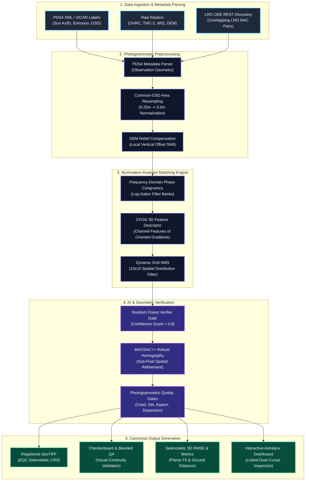
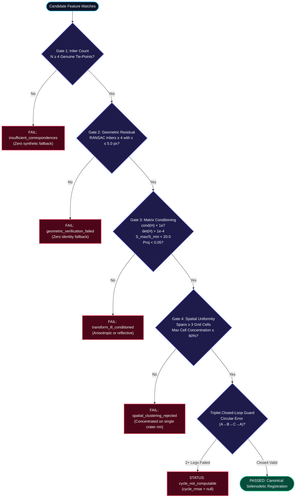
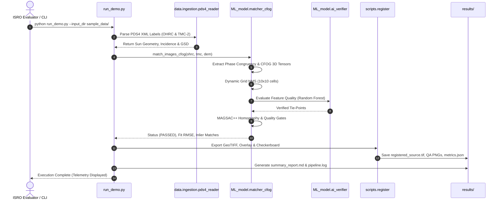

# 🛰️ Chandrayaan-2 Multi-Modal Lunar Image Registration Engine

[](https://www.sih.gov.in/)
[](https://www.python.org/)
[](https://fastapi.tiangolo.com/)
[](https://nextjs.org/)
[](LICENSE)

> **Autonomous, Sun-Angle Invariant, and Scale-Adaptive Cross-Sensor Photogrammetric Registration Pipeline**  
> Designed for Chandrayaan-2 **OHRC** (0.25 m/px), **TMC-2** (5.0 m/px), **IIRS** (70–80 m/px), and **LRO NAC** orbital imagery.

---

## 📑 Table of Contents
- [1. Executive Overview](#1-executive-overview)
- [2. System Architecture](#2-system-architecture)
- [3. Photogrammetric Quality Gates](#3-photogrammetric-quality-gates)
- [4. Pipeline Execution Sequence](#4-pipeline-execution-sequence)
- [5. Full-Stack Application Layout](#5-full-stack-application-layout)
- [6. Quickstart: Running the Pipeline](#6-quickstart-running-the-pipeline)
- [7. Official ISRO Evaluation Wrapper](#7-official-isro-evaluation-wrapper)
- [8. Repository Input/Output Policy](#8-repository-inputoutput-policy)
- [9. Repository Structure](#9-repository-structure)
- [10. Scientific Principles & Error Bounds](#10-scientific-principles--error-bounds)

---

## 1. Executive Overview

Registering multi-modal lunar orbital datasets presents severe photogrammetric challenges:
- **Massive GSD Scale Discrepancies**: High-resolution OHRC (~0.25 m/px) versus wide-swath TMC-2 (~5 m/px) exhibits a ~20× linear resolution gap.
- **Opposing Illumination & Shadow Inversion**: Solar azimuth shifts ($\Delta\theta_{\text{sun}} \approx 160^\circ$) cause total crater shadow reversal where intensity correlation fails.
- **Lunar Topographic Parallax**: Relief differences between disparate orbital passes create severe non-rigid displacements.

This pipeline resolves these challenges using:
1. **Common-GSD Area Averaging**: Downsampling high-resolution OHRC to physical working scales.
2. **Phase Congruency & CFOG 3D Tensors**: Illumination-invariant structural feature matching.
3. **DEM Ray-Intersection Relief Warping**: Compensating for elevation parallax.
4. **4-Tier Photogrammetric Quality Gates**: Mathematically failing closed against false registrations.

---

## 2. System Architecture



---

## 3. Photogrammetric Quality Gates

To guarantee scientific integrity and prevent catastrophic distortions, every registration candidate must pass **four deterministic Quality Gates**:



---

## 4. Pipeline Execution Sequence



---

## 5. Full-Stack Application Layout

The repository includes a modern full-stack web application designed for interactive mission operations:

```mermaid
graph LR
    subgraph FRONTEND["Next.js 14 Frontend (lunar-frontend)"]
        UI1["Astralynx Mission Console"]
        UI2["Linked Dual-Cursor Panel<br/>(Sub-pixel Cross-Hair Sync)"]
        UI3["3D Interactive Lunar Globe<br/>(Three.js Planetary Visualization)"]
        UI4["Data Ingestion & Ingest Pipeline<br/>(Zero Auth Barrier)"]
    end

    subgraph BACKEND["FastAPI Backend (backend/)"]
        API1["GET /triplets<br/>(Dataset Catalog)"]
        API2["GET /triplets/{id}/matches<br/>(Tie-Points & Homography)"]
        API3["POST /register<br/>(Live On-Demand Registration)"]
        API4["POST /api/ingest/upload<br/>(PDS4 Batch Processing)"]
    end

    subgraph ENGINE["Core Registration Pipeline"]
        PY1["master_pipeline.py"]
        PY2["matcher_cfog.py"]
        PY3["ai_verifier_model.pkl"]
    end

    FRONTEND <-->|REST / JSON| BACKEND
    BACKEND --> ENGINE
```



---

## 6. Quickstart: Running the Pipeline

### Step 1: Clone Repository & Create Virtual Environment
```bash
git clone https://github.com/Naivedya-Shilpi/Lunar-Image-Registration.git
cd Lunar-Image-Registration

# Create Python virtual environment
python -m venv .venv
source .venv/bin/activate    # On Linux/macOS
# OR on Windows PowerShell:
# .venv\Scripts\Activate.ps1

# Install core dependencies
pip install -r requirements.txt
```

### Step 2: Run the Registration Demo
Execute the full registration pipeline on the bundled sample inputs:
```bash
python run_demo.py
```
This automatically:
1. Ingests `sample_data/ohrc_sample.png` and `sample_data/tmc_sample.png` along with PDS4 XML metadata.
2. Applies DEM relief compensation and Phase Congruency / CFOG feature extraction.
3. Performs 10×10 Grid NMS and MAGSAC++ homography estimation.
4. Validates all 4 Quality Gates.
5. Generates registered products inside `results/registration_products/` (GeoTIFF, checkerboard, overlay, matches, and metrics).
6. Compiles a Markdown telemetry report in `results/summary_report.md`.

---

## 7. Official ISRO Evaluation Wrapper

For independent automated evaluation on test datasets without manual configuration:

```bash
python scripts/isro_official_evaluator.py --input_dir <path_to_test_dataset> --output_dir ./eval_results --use_dem=True
```

The evaluator executes:
- Multi-dataset recursive ingestion and PDS4 label parsing.
- Automated registration with DEM relief compensation.
- Exports `isro_evaluation_summary.json` and human-readable Markdown evaluation reports.

---

## 8. Repository Input/Output Policy

> [!IMPORTANT]
> **Inputs are tracked. Outputs are gitignored.**  
> Anyone cloning this repository receives clean source code and raw input datasets (`sample_data/`, benchmark input crops `data_preprocessing_pipeline/processed_triplets/`, and UI basemaps).
> 
> All pipeline outputs (`results/`, `registration_output/`, `data_preprocessing_pipeline/matches/`, generated registered images) are strictly excluded via `.gitignore`. You must run the pipeline (`python run_demo.py`) to generate outputs.

---

## 9. Repository Structure

```
Lunar-Image-Registration/
├── README.md                           # Main interactive documentation
├── run_demo.py                         # Single-click pipeline execution script
├── requirements.txt                    # Python dependencies
├── .gitignore                          # Strict input/output exclusion configuration
│
├── sample_data/                        # Raw sample inputs (TRACKED)
│   ├── ohrc_sample.png                 # High-resolution OHRC sample
│   ├── ohrc_sample.xml                 # PDS4 XML observation metadata
│   ├── tmc_sample.png                  # Reference TMC-2 sample
│   ├── tmc_sample.xml                  # PDS4 XML observation metadata
│   ├── iirs_sample.png                 # Hyperspectral contextual sample
│   └── dem_sample.png                  # DEM topography sample
│
├── ML_model/                           # Registration & Photogrammetry Algorithms
│   ├── master_pipeline.py              # Central registration orchestrator
│   ├── matcher_cfog.py                 # Phase Congruency & CFOG 3D gradient tensor
│   ├── ai_verifier.py                  # Random forest match verification
│   ├── ai_verifier_model.pkl           # Pre-trained verifier model weights
│   ├── geometry.py                     # Photogrammetric projective transformations
│   ├── relief_warper.py                # DEM ray-intersection terrain compensation
│   ├── tmc_stereo.py                   # TMC-2 stereo disparity & photogrammetry
│   └── lro_ode_client.py               # LRO ODE REST automated candidate discovery
│
├── data_preprocessing_pipeline/        # Preprocessing & Regional Datasets
│   ├── processed_triplets/             # Regional input crops (region_001 to 006)
│   ├── scripts/                        # Ingest & preparation scripts
│   └── config/                         # Pipeline configuration schemas
│
├── backend/                            # FastAPI Application
│   ├── main.py                         # REST API entrypoint & routes
│   ├── routers/                        # Endpoints (triplets, registration, ingest)
│   └── data/loader.py                  # Data loading & dynamic serving
│
├── lunar-frontend/                     # Next.js 14 Web Application
│   ├── src/app/                        # Next.js App Router
│   ├── src/components/                 # Console, Linked Cursor, 3D Globe
│   └── src/lib/                        # API client (direct access, zero auth barrier)
│
├── scripts/                            # CLI Tools & Evaluation Utilities
│   ├── isro_official_evaluator.py      # Official ISRO evaluation CLI
│   ├── register.py                     # Regional batch registration utility
│   └── register_lro_nac.py             # LRO NAC cross-registration utility
│
├── docs/                               # Detailed Photogrammetric Documentation
│   ├── architecture.md                 # Component-level architecture with Mermaid
│   ├── pipeline_flow.md                # Execution sequence with Mermaid
│   ├── methodology.md                  # Mathematical formulations & derivations
│   └── ENGINEERING_CHALLENGES.md       # Orbital photogrammetry challenges
│
└── results/                            # Generated Pipeline Outputs (GITIGNORED)
    └── .gitkeep                        # Output directory placeholder
```

---

## 10. Scientific Principles & Error Bounds

### Illumination Invariance Formulation
Rather than computing gradients directly on unstable raw pixel intensities $I(x,y)$, the pipeline computes multi-scale phase congruency:

$$PC(x,y) = \frac{\sum_n W(x,y) \lfloor A_n(x,y) \Delta\Phi_n(x,y) - T \rfloor}{\sum_n A_n(x,y) + \epsilon}$$

The Channel Features of Oriented Gradients (CFOG) then project gradients into directional orientation bins:

$$\text{CFOG}_k(x,y) = G(x,y) \cdot \max\left(0, \cos(\theta(x,y) - \theta_k)\right)^m$$

### Selenodetic Absolute Distance Metric
Planar fit RMSE in pixel space is complemented by true topographically corrected ground distance in meters:

$$\text{RMSE}_{\text{absolute}} = \sqrt{\frac{1}{N}\sum_{i=1}^N \left( \left(X_i^{\text{src}} - X_i^{\text{ref}}\right)^2 + \left(Y_i^{\text{src}} - Y_i^{\text{ref}}\right)^2 + \Delta Z_i^2 \right)}$$

---

## 👥 Authors & Acknowledgments
- **Team Astralynx** — Smart India Hackathon (SIH) 2024 / 2026
- **Problem Statement**: ISRO SIH 26166
- Imagery courtesy of **ISRO / SAC / ISSDC (Chandrayaan-2)** and **NASA / GSFC / ASU (LRO NAC)**.
