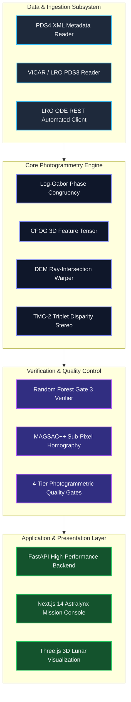
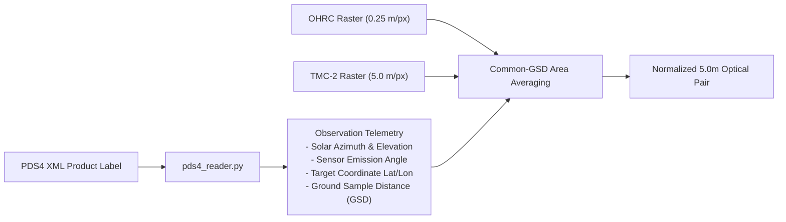
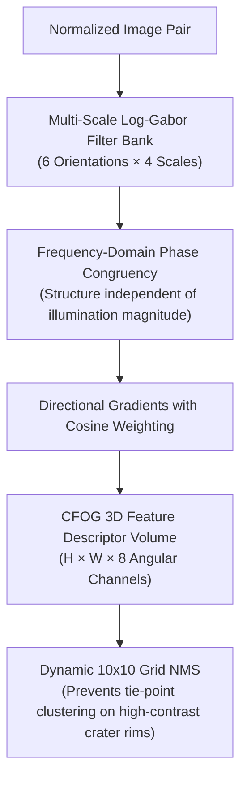
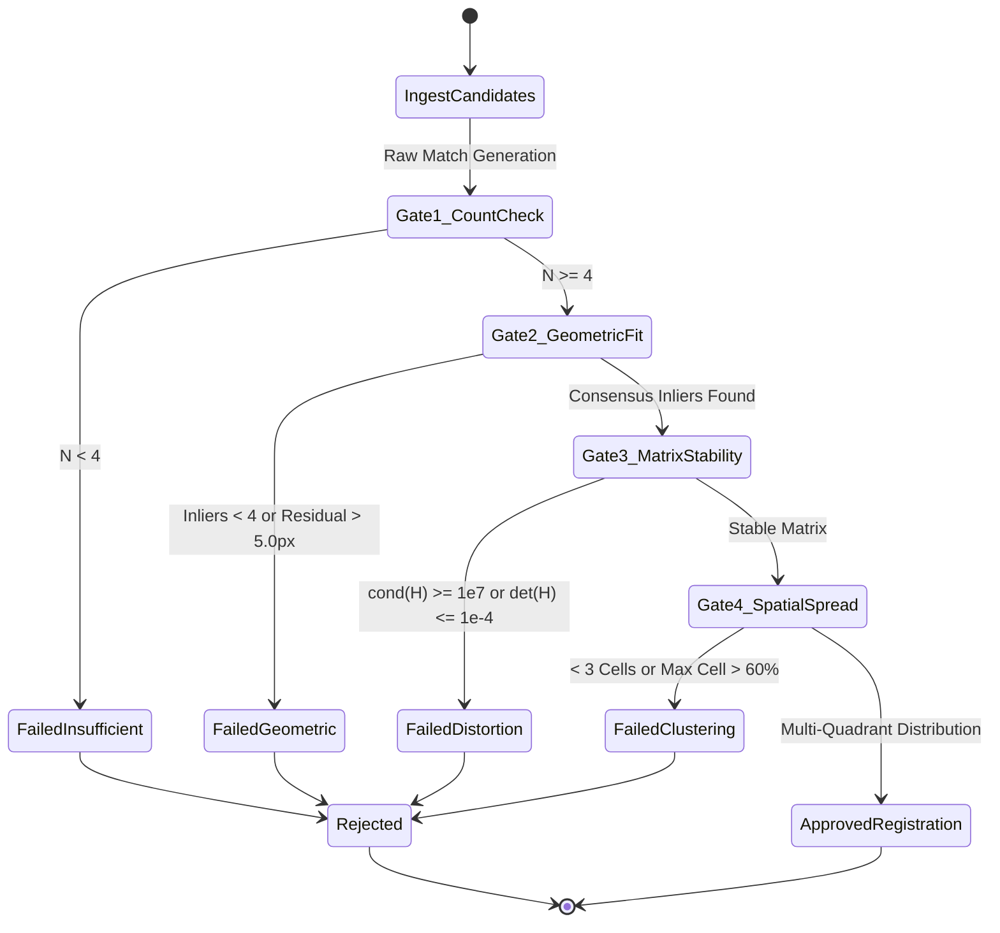

# 🏛️ System Architecture & Engineering Design

This document details the photogrammetric, computer vision, and software engineering architecture of the **Chandrayaan-2 Multi-Modal Lunar Image Registration Engine**.

---

## 1. High-Level Modular Design

The system is partitioned into five distinct modular subsystems:

---

## 2. Ingestion & Preprocessing Subsystem

The ingestion engine handles raw ISRO PDS4 XML product labels and NASA PDS3 Vicar headers:

---

## 3. Illumination-Invariant Matching Subsystem

Under low sun elevation ($10^\circ - 30^\circ$) and opposing solar azimuth ($\Delta\theta_{\text{sun}} \approx 160^\circ$), raw intensity gradients flip direction ($180^\circ$).

---

## 4. Quality Gate State Machine

