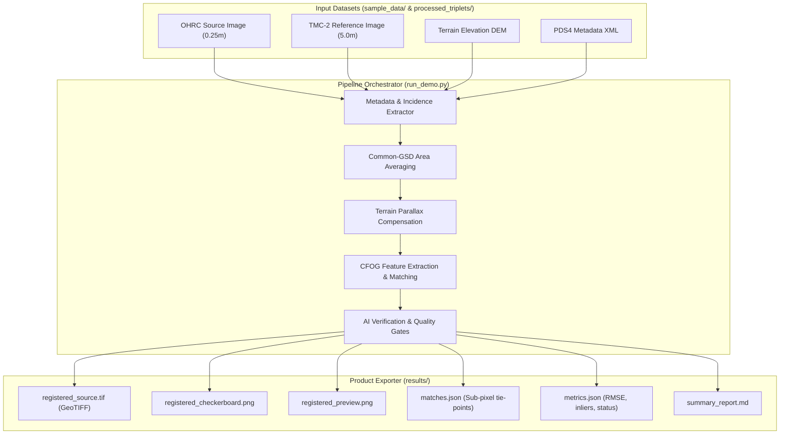
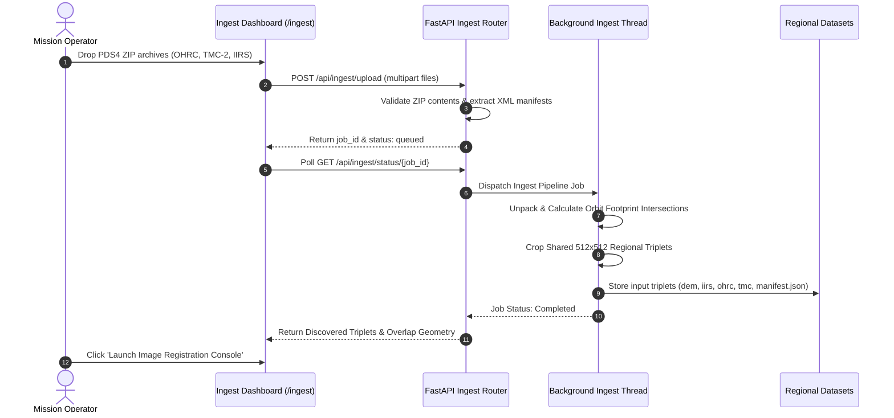

# ⚡ Pipeline Execution & Data Flow

This document details the data lifecycle, execution pathways, and product generation mechanisms across the registration pipeline.

---

## 1. End-to-End Pipeline Data Flow



---

## 2. Dynamic Regional Ingestion Flow

For new user-uploaded or bulk PDS4 zip packages, the backend executes an asynchronous background worker flow:



---

## 3. Composed Hyperspectral (IIRS) Registration Pathway

Because IIRS is an ~70–80 m/px spectrometer, direct sub-meter tie-points between OHRC and IIRS are physically ill-posed. The pipeline computes an honest **composed geometric chain**:

```mermaid
graph LR
    OHRC["OHRC (0.25 m/px)"] -->|H_OT (Measured Inliers >= 4)| TMC["TMC-2 (5.0 m/px)"]
    TMC -->|H_TI (Spectral Continuum Anchor)| IIRS["IIRS (70-80 m/px)"]
    OHRC -.->|Composed Transform: H_OI = H_TI &times; H_OT| IIRS

    style OHRC fill:#0f172a,stroke:#38bdf8,stroke-width:2px,color:#fff
    style TMC fill:#1e1b4b,stroke:#818cf8,stroke-width:2px,color:#fff
    style IIRS fill:#064e3b,stroke:#34d399,stroke-width:2px,color:#fff
```

> **Notice**: Composed OHRC&rarr;IIRS tie-points are recorded strictly as derived context overlays and are never falsely reported as direct sub-pixel optical matches.
